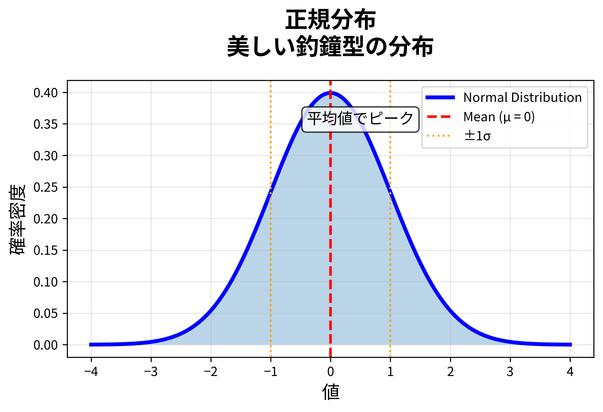

# 統計思考のススメ

## 日常に潜む数字の真実を見抜く力

  
    Press Space for next page 
  

  <a href="https://github.com/slidevjs/slidev" target="_blank" alt="GitHub" title="Open in GitHub"
    class="text-xl slidev-icon-btn opacity-50 !border-none !hover:text-white">
    
  </a>

<!--
皆さん、こんにちは。今日は「統計思考のススメ」と題して、
日常生活で出会う様々な数字の裏側に隠された真実を、
一緒に探っていきたいと思います。
-->

---
layout: intro
class: text-center
---

# 自己紹介

  <h2 class="text-5xl font-bold mt-6 mb-4 bg-gradient-to-r from-blue-400 to-purple-600 bg-clip-text text-transparent">熊田 翔</h2>
  
統計学には昔から興味があり、仕事でも使ってきました

  

    

    <h3 class="text-lg font-bold mb-2">🏆 統計関連資格</h3>
    
統計検定 1級・準1級・2級

  

  

    

    <h3 class="text-lg font-bold mb-2">🔬 趣味が高じて</h3>
    
統計学は趣味から始めた 探究心の賜物

  

  

    

    <h3 class="text-lg font-bold mb-2">⚙️ 現在の戦場</h3>
    
製造業×データサイエンス 現場の数字と格闘中

  

「数字の向こう側にある、本当の物語を一緒に見つけましょう！」

<!--
どうも、熊田です！今日はよろしくお願いします。
簡単に自己紹介をさせてください。
-->

---
layout: two-cols
---

# 私のキャリア

### 🏭 最初の10年：モノづくりの現場

- 大手電機メーカー・半導体スタートアップ
- パワー半導体の生産技術者
- **年間数千万円のコスト削減**を実現
- データ活用の可能性に目覚める

::right::

### 📊 その後の4年：データの世界へ

- 34歳でデータサイエンティストに転身
- 化学プラントの故障原因究明
- **AIによる予知保全システム**開発
- 最近は**生成AI**のシステム開発も

  

    現場のリアル × データ分析 = 課題解決
  

  

<!--
私のキャリアは少し変わっていて、製造業の現場とデータサイエンスという
2つの世界を経験しているのが強みです。
-->

---
layout: center
class: text-center
---

# その数字、信じて大丈夫？

  「お客様満足度95%！」

  「視聴率20%超えの大ヒットドラマ」

  「〇〇の成功率80%」

  本当にそうでしょうか？🤔

<!--
皆さん、こんな数字を見たことありませんか？
でも、これらの数字、本当に信じていいのでしょうか？
-->

---
layout: fact
---

# 今日のゴール

  
難しい計算は一切しません！

  
数字に騙されず、賢く付き合うための

  
「統計思考」

  
を一緒に探検しましょう

  まるで「数字の探偵」になるようなものです！ 🕵️

<!--
今日は難しい数学の話はしません。
皆さんが日常生活で数字と賢く付き合うための「考え方のコツ」、
つまり統計思考を身につけていただきます。
-->

---
layout: section
---

# アイスブレイク統計クイズ

## 頭の体操をしてみましょう！

<!--
本題に入る前に、皆さんの直感がどれくらい正しいか試してみましょう。
-->

---

# クイズ1：モンティ・ホール問題

  

    <h3 class="text-lg font-bold mb-2">📋 前提条件</h3>
    <ul class="text-sm space-y-1">
      <li>3つのドアのうち1つに車、2つにヤギが隠されています</li>
      <li>司会者はどのドアに何があるかを知っています</li>
      <li>司会者は必ずヤギのドアを開けます</li>
      <li>あなたの目標は車を当てることです</li>
    </ul>
  

  
  

    
あなたはドア1を選びました。司会者がドア3を開けてヤギを見せました。

    
ドアを変えますか？それとも変えませんか？

  

  

    
🚪

    
ドア 1

    
🚗 or 🐐

  

  

    
🚪

    
ドア 2

    
🚗 or 🐐

  

  

    
🚪

    
ドア 3

    
（司会者が開ける）

    
🐐

  

<v-click>

  
正解：ドアを変えた方が当たる確率が2倍に！

  
最初:1/3 → 変更後:2/3

</v-click>

<!--
有名なモンティ・ホール問題です。
直感に反しますが、ドアを変えると当たる確率が2倍になるんです。
-->

---

# モンティ・ホール問題の解説

  

    <h3 class="text-xl mb-4">🎥 詳しい解説動画</h3>
    <iframe 
      width="100%" 
      height="315" 
      src="https://www.youtube.com/embed/1MuwwFipX9o" 
      title="モンティ・ホール問題の詳しい解説" 
      frameborder="0" 
      allow="accelerometer; autoplay; clipboard-write; encrypted-media; gyroscope; picture-in-picture" 
      allowfullscreen>
    </iframe>
  

  
  

    

      <h3 class="text-lg font-bold mb-3">なぜ確率が2倍に？</h3>
      
この動画で、なぜドアを変えると確率が2倍になるのかを分かりやすく解説しています！

      

        
💡 ポイント

        
直感に反する結果の理由を視覚的に理解できます

      

    

  

<!--
モンティ・ホール問題の詳しい解説動画です。
直感に反する結果の理由を詳しく説明しています。
-->

---

# クイズ2：グラフのトリック

  

    <h3 class="text-xl mb-4">このグラフを見ると...</h3>
    

      
    

    
売上が2倍以上に急成長！？

  

  
  

    <h3 class="text-xl mb-4">でも実際は...</h3>
    <v-click>
    

      
伸び率はたったの10%

      
縦軸が0から始まっていないため、

      
変化が誇張されて見えるのです

    

    </v-click>
  

<!--
グラフの見せ方一つで、同じデータでも全く違う印象を与えることができます。
これが統計リテラシーが必要な理由の一つです。
-->

---

# クイズ3：秘書問題【最適停止問題】

  

    <h3 class="text-lg font-bold mb-3">📋 問題設定</h3>
    

      <ul class="text-sm space-y-2">
        <li>100人の候補者から1人の秘書を採用したい</li>
        <li>候補者は1人ずつ順番に面接する</li>
        <li>その場で採用/不採用を決めなければならない</li>
        <li>一度不採用にした人は二度と呼び戻せない</li>
        <li>最優秀の人を採用したい</li>
      </ul>
    

    

      
🤔 どうすれば最適な人を選べる？

      
何人目で決断すべきでしょうか？

    

  

  

    <h3 class="text-lg font-bold mb-3">✨ 統計学的な最適解</h3>
    <v-click>
    

      
37%ルール

      <ul class="text-sm space-y-2">
        <li>1. 最初の37人（100人の37%）は見送る</li>
        <li>2. その中で最も優秀だった人を基準とする</li>
        <li>3. 38人目以降で基準を超えたら即採用！</li>
      </ul>
    

    

      
📊 この戦略の成功確率：約37%

      
数学的に証明された最適戦略です（1/e ≈ 0.368）

    

    

      
💡 日常生活でも応用可能：家探し、転職、パートナー選びなど

    

    </v-click>
  

---

# 秘書問題の解説

  

    <h3 class="text-xl mb-4">🎥 詳しい解説動画</h3>
    <iframe 
      width="100%" 
      height="315" 
      src="https://www.youtube.com/embed/hUEtN6-kVqk" 
      title="秘書問題（最適停止問題）の詳しい解説" 
      frameborder="0" 
      allow="accelerometer; autoplay; clipboard-write; encrypted-media; gyroscope; picture-in-picture" 
      allowfullscreen>
    </iframe>
  

  
  

    

      <h3 class="text-lg font-bold mb-3">なぜ37%なのか？</h3>
      
この動画で、最適停止問題の数学的な背景と、なぜ37%（1/e）が最適解になるのかを分かりやすく解説しています！

      

        
💡 ポイント

        
日常生活での応用例も紹介されています

      

    

  

<!--
秘書問題（最適停止問題）の詳しい解説動画です。
数学的な証明と実生活での応用例を説明しています。
-->

---
layout: center
---

# 統計思考とは？

  1つの数字や出来事だけでなく 
  全体像とつながりを見て 
  物事の本質を探る考え方

  

    
📊

    
全体像で見る

    
平均とばらつき

  

  

    
🔗

    
つながりを見抜く

    
相関と因果

  

  

    
🎲

    
不確かさを乗りこなす

    
確率と期待値

  

<!--
統計思考とは、単に数字を見るだけでなく、
その背景にある全体像やつながりを理解する考え方です。
-->

---
layout: section
---

# 神が仕組んだ4つのパターン

## 数字の『カタチ』を知る

<!--
一見、混沌として見えるこの世界。
しかし、その背後には驚くべき秩序が隠されています。
-->

---
layout: two-cols
---

# 1. 自然界の秩序：正規分布

### 📐 確率密度関数

$$f(x) = \frac{1}{\sqrt{2\pi\sigma^2}} e^{-\frac{(x-\mu)^2}{2\sigma^2}}$$

- μ：平均値（分布の中心）　　σ：標準偏差（分布の広がり）

::right::

### ✅ どんなカタチ？
平均値を中心にした、左右対称の美しい釣鐘型（ベルカーブ）

### ✅ 身近な利用例
身長や体重、製品の誤差など

### ✅ 作られた歴史
天体の位置を観測する際の「誤差」の研究から体系化されました。まるで、**この宇宙に存在するあらゆる『誤差』や『ズレ』でさえも、創造主が定めた美しい法則に従っている**かのような発見でした。偏差値の考え方もここから生まれています。

> 宇宙に存在するあらゆる『誤差』や『ズレ』でさえも、創造主が定めた美しい法則に従っている

<!--
正規分布は、自然界で最も頻繁に現れる分布です。
平均値を中心に左右対称な美しい形をしています。
-->

---
layout: two-cols
---

# 2. 運命の選択：二項分布

### 📐 確率質量関数

$$P(X = k) = \binom{n}{k} p^k (1-p)^{n-k}$$

- n：試行回数　　p：成功確率　　k：成功回数

::right::

### ✅ どんなカタチ？
「成功か失敗か」の2択を繰り返したときの結果の分布

### ✅ 身近な利用例
コイン投げ、シュートの成功回数、品質管理

### ✅ 作られた歴史
サイコロ賭博の勝敗確率の研究から生まれました。

> 偶然の象徴であるコイン投げの中に、ベルヌーイは神の定めたゲームのルールを垣間見た

<!--
二項分布は、「成功か失敗か」という2択を繰り返したときの結果を表します。
-->

---
layout: two-cols
---

# 3. 摂理のささやき：ポアソン分布

### 📐 確率質量関数

$$P(X = k) = \frac{\lambda^k e^{-\lambda}}{k!}$$

λ：平均発生回数　　e：自然対数の底（≈2.718）　　k：実際の発生回数

::right::

### ✅ どんなカタチ？
一定期間に「珍しいこと」が起こる回数の分布

### ✅ 身近な利用例
1日の交通事故の件数、1時間の電話の着信数、お客様の来店数

### ✅ 作られた歴史
当初は「裁判における誤審の数」を推定するために使われました。

> 気まぐれに起こる人の世の出来事にも、実は天の定めた脈拍（リズム）がある

<!--
ポアソン分布は、一定期間に珍しいことが起こる回数を表します。
地震の確率計算にも使われる重要な分布です。
-->

---
layout: two-cols
---

# 4. 富の宿命：対数正規分布

### 📐 確率密度関数

$$f(x) = \frac{1}{x\sqrt{2\pi\sigma^2}} e^{-\frac{(\ln x - \mu)^2}{2\sigma^2}}$$

- μ：対数の平均　　σ：対数の標準偏差

::right::

### ✅ どんなカタチ？
大多数が低い値に、一部だけが極端に高い値を持つ、長い裾を引いた形

### ✅ 身近な利用例
個人の所得分布、SNSのフォロワー数、株価

### ✅ 作られた歴史
「成長率は、その時点での大きさに比例する」という法則から導かれます。**富や成功といった人の世の理（ことわり）までもが、あらかじめ定められた普遍的な法則の上に成り立っている**ことを、この分布は静かに物語っています。

### ✅ グラフの2つの曲線
- 🟠 σ = 0.5（あまり歪まない形）
- 🔴 σ = 1.0（より歪む形）
- σが大きいほど『少数が極値を持つ』現象が顕著に

**🔴 赤い曲線（σ = 1.0）の方が格差が大きい**  
より多くの人が低い値に集中し、少数がより極端に高い値を持つ

<!--
対数正規分布は、大多数が低い値に集中し、
一部だけが極端に高い値を持つ分布です。
これが「平均年収」が実感とズレる理由です。
-->

---
layout: section
---

# 実践！日常にひそむ統計思考

## 学んだ知識を使って謎を解き明かそう

<!--
では、学んだ知識を使って、私たちの身の回りにある数字の謎を解き明かしていきましょう！
-->

---
layout: two-cols
---

# ケース1：選挙速報の謎

### 🤔 疑問：なぜ開票0%で「当選確実」？

### 🗳️ 出口調査
投票所での聞き取り調査

### 📊 統計思考の答え：標本調査
- 出口調査で「縮図」を作る
- 偏りのないサンプル選び
- 少数から全体を高精度で推定

> 💡 全員に聞かなくても、上手にサンプルを選べば全体が分かる！

::right::

<!--
選挙速報で開票率0%なのに当選確実が出る理由は、
統計学の標本調査という技術のおかげです。
ベン図で母集団（全有権者）と標本（出口調査対象者）の関係を視覚的に説明しています。
-->

---
layout: two-cols
---

# 選挙速報の統計データ

::right::

<!--
選挙速報で使われる統計データの可視化です。
左：サンプル数と誤差の関係、右：出口調査と実際の結果の比較を示しています。
-->

---

# ケース2：地震確率の真実

### 「南海トラフ地震、30年以内に約26%」の意味

## 計算の仕組み（ポアソン分布）

1. 平均100年に1回発生と仮定
2. 30年間「起きない確率」を計算
3. 約74%（だから起きる確率26%）

## ⚠️ 本当の意味

- 「30年後が危ない」ではなく
- **「今この瞬間から危険」**

## 📝 統計モデルの限界

- 実際の地震には周期性がある
- 統計的思考理解のための簡易例

  
🏚️

  
備えあれば憂いなし

  
統計は警告 行動は今すぐ

<!--
地震の確率は、ポアソン分布を使って計算されています。
-->

---

# ポアソン分布による地震確率の計算

### 📊 計算の仕組み

**1 - P(地震なし) = P(地震あり)**

- 左グラフ：ポアソン分布による各発生回数の確率
- 右グラフ：補集合を利用した地震発生確率の計算

<!--
ポアソン分布を使った地震確率計算の仕組みを視覚的に説明。
「起きない確率」から「起きる確率」を求める補集合の関係を図示。
-->

---

# ケース3：生成AIの謎

### ChatGPTはどうやって文章を作る？

## 生成AIの正体
**超巨大な「次の単語予測マシン」**

## Temperature（温度）設定

| 🧊 低い | 🔥 高い |
|---------|---------|
| 確率の高い無難な単語 | 創造的だが不正確も |

  
「今日の天気は...」

  

    晴れ 45% 
    曇り 30% 
    雨 25%
  

  
🤖

  
次の単語を確率で選択

<!--
生成AIは、実は統計モデルそのものです。
-->

---

# Temperature設定による創造性の制御

---

# ケース3：生成AIと統計の関係

  

    生成AIは統計と確率の塊！
  

  

    「もっともらしい」≠「正しい」
  

  
生成AIは膨大なデータから

  
「次に来そうな単語」を確率的に予測

  
だから時々ウソをつく！

<!--
膨大なデータから「次に来そうな単語」を確率的に予測しているだけなんです。
-->

---

# ケース4：期待値の謎

### 「平均的に得をする」という魔法の数字

## 🎯 期待値が考え出された背景

- **17世紀のギャンブル問題**から誕生
- パスカルとフェルマーが「公平な分配」を数学的に解決
- 「運」を「数学」で予測する革命的アイデア

## 🎲 期待値の目的

- **未来の結果を予測**：完全ではないが「傾向」がわかる
- **リスクと利益のバランス**：投資や保険の基本概念
- **公平性の判断基準**：ゲームやクジが「フェア」かどうか

---
layout: two-cols
---

# 期待値の実際の利用シーン

## 💼 ビジネス・投資
- **株式投資**：将来のリターン予測
- **保険**：保険料の計算基準
- **マーケティング**：キャンペーンの効果予測

## 🎮 日常生活
- **宝くじ**：「期待値マイナス」だから胴元が儲かる
- **ガチャ**：スマホゲームの排出率
- **スポーツくじ**：「投資」か「娯楽」かの判断

## 🏥 医療・科学
- **治療効果**：新薬の効果予測
- **リスク評価**：副作用の発生確率

::right::

  

---

# 期待値の計算方法

## 🧮 基本の公式

**期待値 = Σ(各結果の値 × その確率)**

## 📊 具体例：コイン投げゲーム

  

    <h3 class="text-lg font-bold mb-4">ゲームのルール</h3>
    <ul class="text-sm space-y-2">
      <li>• 参加費：100円</li>
      <li>• 表が出たら：200円もらえる</li>
      <li>• 裏が出たら：0円</li>
      <li>• 各面の確率：50%</li>
    </ul>
  

  
  

    <h3 class="text-lg font-bold mb-4">期待値の計算</h3>
    

      
期待収入 = 200円×0.5 + 0円×0.5 = 100円

      
期待利益 = 100円 - 100円 = 0円

      
→ フェアなゲーム！

    

  

## ⚠️ 期待値の落とし穴

- **「平均的に」は「必ず」ではない**
- **短期では大きくブレる可能性**
- **感情的な判断を数字で補強**

---

# 日本のギャンブル期待値ランキング

### 🎰 統計思考で見る「お得度」比較

  <a href="https://docs.google.com/document/d/1jfXmAFdNSUs96jsvNL3PZhwN0Bnn3yqz2mG-Ekam3es/edit?usp=sharing" target="_blank" class="text-blue-600 hover:text-blue-800 underline text-lg font-bold">
    📊 日本のギャンブルにおける期待値の分析レポート：洗練されたプレイヤーのための包括的ガイド
  </a>

| 順位 | ギャンブル種別 | 期待値 | 特徴 | 💡 ポイント |
|:---:|:---|:---:|:---|:---|
| 🥇 | **パチンコ・パチスロ** | 85～115% | 設定次第で100%超も可能 | スキル＋情報戦 |
| 🥈 | **競馬** | 70～80% | 券種により変動 | 知識が活かせる |
| 🥉 | **競輪・競艇** | 約75% | 一律の還元率 | 予測スキルが重要 |
| 4位 | **オートレース** | 約70% | キャンペーンで改善 | プロモーション狙い |
| 5位 | **スポーツくじ** | 約50% | 純粋な運勝負 | 娯楽として割り切り |
| 6位 | **宝くじ** | 約46% | 最も低い還元率 | 「夢代」として考える |

<!--
各ギャンブルの期待値を比較することで、統計的に「お得」な選択が見えてきます。
参考資料：https://docs.google.com/document/d/1jfXmAFdNSUs96jsvNL3PZhwN0Bnn3yqz2mG-Ekam3es/edit?usp=sharing
-->

---

# ギャンブル期待値の統計思考

### 🔍 統計思考のポイント

  

    <h4 class="font-bold mb-2">✅ プラス期待値の可能性</h4>
    
パチンコ・パチスロのみ100%超が理論上可能

    
※高設定台の見極めとスキルが必要

  

  
  

    <h4 class="font-bold mb-2">⚖️ スキルの影響度</h4>
    
公営競技：知識と分析力で差がつく

    
宝くじ：スキル無関係の純粋な運

  

### 💭 期待値から見た選択指針

  

    <h4 class="font-bold mb-2">💰 投資思考</h4>
    
パチスロ（情報収集＋技術習得が前提）

    
理論上プラス期待値だが、高度なスキルと時間投資が必要

  

  
  

    <h4 class="font-bold mb-2">🏇 趣味・娯楽</h4>
    
競馬・競輪（スポーツ知識を活かす）

    
知識と分析力で楽しみながら期待値改善の可能性

  

  
  

    <h4 class="font-bold mb-2">✨ 夢購入</h4>
    
宝くじ（エンターテインメント料54%を承知の上で）

    
統計的には不利だが、夢を買う娯楽として割り切る

  

### 🎯 統計思考の結論

  
期待値は選択の指針であり、絶対的な答えではない

  
目的と価値観に合った「賢い選択」を統計思考で支援する

<!--
期待値の比較を通じて、統計思考による意思決定の重要性を理解できます。
数字だけでなく、個人の目的や価値観も考慮した総合的な判断が大切です。
-->

---
layout: section
---

# 演習：統計の罠を見抜こう！

## 実際のニュースやグラフから問題点を探す

<!--
それでは、実際のニュースやグラフを見て、
統計的な問題点を見つける練習をしてみましょう。
-->

---

# 演習1：誤解を招くグラフ

### このグラフの問題点は？

  

    
  

  
  

    
### 見つけるべきポイント
- 縦軸は0から始まっている？
- 目盛りの間隔は一定？
- 比較対象は公平？

### 正しい表示方法
必ず0から始め、一定の目盛りで表示する
    
  

<!--
グラフを見るときは、まず軸の設定を確認しましょう。
これだけで多くのトリックを見抜けます。
-->

---

# 演習2：相関と因果の混同

### ニュース記事の例
「アイスクリームの売上が増えると、溺死事故が増加」

<!--
相関関係があっても因果関係があるとは限りません。
-->

---

# 演習2：相関と因果の解釈

  <h3 class="text-2xl font-bold text-center mb-4">真の原因：夏（気温）🌞</h3>
  
両方に影響を与える第3の要因を探そう！

  
アイスクリーム売上 ← 気温 → 水遊び機会増加

  
直接の因果関係はない！

<!--
第3の要因が両方に影響していることがよくあります。
-->

---

# 演習3：サンプルバイアス

### アンケート結果の例
「インターネット調査：スマホ利用率95%」

<!--
調査方法によって結果が大きく変わることがあります。
-->

---

# 演習3：バイアスの原因

### 🔍 問題点の分析

  

    
📱 ネット調査 → ネット利用者のみ

    
調査手段が対象を限定してしまう

  

  
  

    
👴 高齢者の意見が反映されない

    
重要な層が調査から除外される

  

  
  

    
💻 デジタルデバイドの無視

    
技術格差が結果を歪める

  

---

# 🚨 サンプルバイアスを撃退せよ！

  <h3 class="text-2xl font-bold text-center mb-6">⚡ バイアス・バスター作戦 ⚡</h3>
  

    

      
🎯

      
多角的攻撃

      
複数の調査方法を併用

    

    

      
⚖️

      
バランス調整

      
年齢層別の重み付け

    

    

      
📋

      
透明性確保

      
調査方法の明記

    

  

  
🔍 探偵の基本ルール 🔍

  
「誰に、どうやって聞いたか」を必ずチェック！

  
これがバイアス発見の鍵 🗝️

<!--
誰に、どうやって聞いたかを必ず確認しましょう。
-->

---
layout: center
---

# 📚 おすすめ書籍

  

    

      
    

    
統計学の実践的な活用法を 分かりやすく解説した名著

  

  
  

    

      
    

    
統計学の歴史と変人たちの エピソードを楽しく学べる

  

  
📖 統計の世界への扉を開こう

---
layout: center
---

# まとめ：統計思考を「一生モノの武器」に

  
✅ 数字を見たら「それって、ほんま？」と疑う

  
✅ 数字の裏にある「カタチ」や「見せ方」に注意

  
✅ 「一部」から「全体」を推測する技術を理解

  
✅ 生成AIも統計と確率の産物と認識

<!--
統計思考は、皆さんの日常生活を豊かにする道具です。
-->

---
layout: center
---

# 統計思考は数字の探偵術

  

    難しい数学ではありません
  

  

    世界をより「解像度高く」見るための 
    面白くて役に立つ視点です
  

  
今日学んだことを、ぜひ明日から実践してみてください

<!--
今日学んだことを、ぜひ明日から実践してみてください。
-->

---
layout: end
class: text-center
---

# 🎉 ミッション・コンプリート！

  

    
🕵️

    
数字の探偵

    
レベルアップ！

  

  

    
🛡️

    
統計の盾

    
装備完了！

  

  

    
⚔️

    
疑問の剣

    
習得済み！

  

  
🌟 今日から君も統計マスター！ 🌟

  
世界をより鋭く見抜く力を手に入れました

  
🎤 質疑応答タイム 🎤

  
何でも聞いちゃってください！

<!--
ご清聴ありがとうございました。
何か質問がございましたら、お気軽にどうぞ。
-->